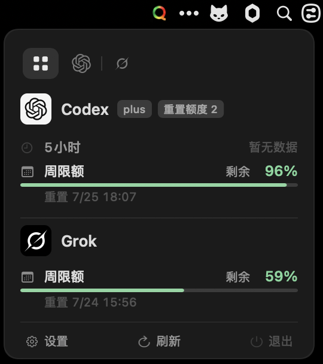
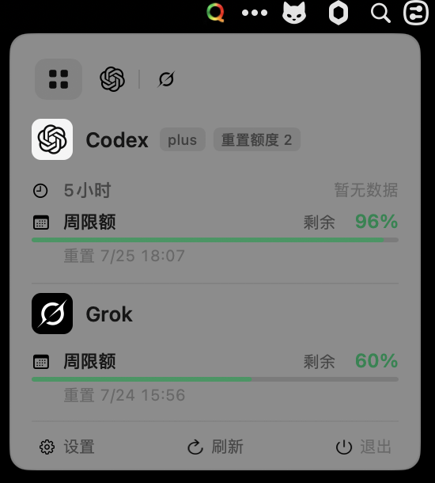

# Quota

[English](README.md)

Quota 是一个轻量级 macOS 菜单栏应用，用于实时查看 [Codex](https://github.com/openai/codex) 的用量配额。

<p align="center">
  
  
  
</p>

> [!NOTE]
> 使用前需要安装 Codex CLI 或 ChatGPT.app，并确保账户有可读取的 rate limit 配额数据。

## 特性

- 菜单栏展示 Codex 5 小时额度、周额度，以及账户可用的重置额度
- Terminal、ChatGPT、Codex 或 IntelliJ IDEA 前台时在 Touch Bar 展示额度
- Touch Bar 显示最近活动 Codex 会话所使用的模型，取不到时回退到默认配置
- 额度不足时发送 macOS 通知
- 每 2 分钟自动刷新，也支持手动刷新
- 支持 Codex app-server 连接代理配置
- 支持全局快捷键打开菜单栏弹窗
- 支持跟随系统、英文和简体中文语言切换
- 以 accessory 模式运行，不占 Dock 栏
- 通过 Codex `app-server` 读取数据，优先使用 `PATH` 中的 `codex`，找不到时依次回退到 ChatGPT.app 内置的 Codex 和旧版 Codex.app

## 截图

### 菜单栏





### Touch Bar


### 额度通知


## 安装

### 下载 DMG

从 [GitHub Releases](https://github.com/slightlee/quota/releases) 下载最新的 `Quota-*.dmg`，打开后将 `Quota.app` 拖入 `Applications`。

### 从源码构建

```bash
git clone https://github.com/slightlee/quota.git
cd quota
bash Scripts/package-app.sh
ditto .build/package/Quota.app /Applications/Quota.app
```

然后从 `Applications` 启动 `Quota.app`。

如需开机自启：

**系统设置 -> 通用 -> 登录项 -> 添加 Quota**

不建议直接运行或复制 `.build/release/Quota` 裸二进制；通知权限、应用图标和菜单栏资源都依赖标准 `.app` 包结构。

## 使用

启动后菜单栏会出现 Quota 图标，稍等片刻自动获取数据。

- 点击菜单栏图标查看 5 小时窗口、周限额和重置额度
- 点击 `刷新` 或按 `⌘R` 手动刷新
- 点击 `设置` 配置代理、全局快捷键和显示语言
- 点击 `退出` 或按 `⌘Q` 退出

Touch Bar 只在 Terminal、ChatGPT、Codex 或 IntelliJ IDEA 前台时显示，切换到其他应用后会隐藏。

### 通知阈值

默认在以下剩余额度阈值发送通知：

- 低于 20%：普通提醒
- 低于 10%：紧急提醒
- 低于 5%：严重不足提醒

每个窗口、每个阈值只提醒一次；额度恢复到 50% 以上后会重置提醒状态。

## 打包

### 生成 `.app`

```bash
bash Scripts/package-app.sh
```

输出：

```text
.build/package/Quota.app
```

### 生成 `.dmg`

```bash
bash Scripts/package-dmg.sh
```

输出：

```text
.build/Quota-<version>.dmg
```

DMG 默认包含固定 Finder 安装窗口布局：左侧为 `Quota.app`，右侧为 `Applications` 快捷入口。如果 CI 环境无法控制 Finder，会自动降级为默认布局但仍生成可用 DMG。

## 工作原理

```text
┌──────────────┐     JSON-RPC (stdio)     ┌──────────────┐
│              │ ◄──────────────────────► │              │
│    Quota     │   account/rateLimits/    │    Codex     │
│              │         read             │ (app-server) │
└──────┬───────┘                          └──────┬───────┘
       │                                         │
       ▼                                         ▼
 ┌──────────────────────────┐             ┌──────────────────────┐
 │ MenuBarController        │             │ TouchBarController   │
 │ + MenuBarLimitView       │             │ + TouchBarLimitView  │
 └──────────────────────────┘             └──────────────────────┘
```

Quota 会启动 Codex 的 `app-server` 子进程，通过 stdin/stdout 上的 JSON-RPC 读取配额数据；如果账户返回重置额度，也会一并展示。数据每 2 分钟刷新一次。

## 隐私

Quota 通过 Codex `app-server` 在本地读取 Codex 配额数据，不会将配额数据或账户信息上传到任何第三方服务。

代理、快捷键和语言设置由 macOS 应用偏好设置保存在本地。

## 常见问题

- 菜单栏没有图标：请从 `Applications` 启动 `Quota.app`，不要直接运行 `.build/release/Quota` 裸二进制。
- 没有配额数据：请确认已安装 Codex CLI 或 ChatGPT.app，并已登录拥有 rate limit 数据的账户。
- 找不到 Codex：请确认 `codex` 在 `PATH` 中，或已将 `ChatGPT.app` 安装到 `/Applications`。
- 没有通知：请在系统设置中检查 Quota 的 macOS 通知权限。

## 系统要求

- macOS 14 Sonoma 或更高版本
- Codex CLI 或 ChatGPT.app
- 拥有可读取 rate limit 配额数据的 Codex 账户

## 开发

```bash
# 本地运行
swift run

# 生成 .app
bash Scripts/package-app.sh

# 生成 .dmg
bash Scripts/package-dmg.sh

# 查看调试日志
swift run 2>&1 | grep "\[Quota\]"
```

## 贡献

- 发现问题？请提交 [Issue](https://github.com/slightlee/quota/issues)。
- 有好想法？欢迎提交 [Pull Request](https://github.com/slightlee/quota/pulls)。
- 如果 Quota 对你有帮助，可以给项目一个 Star 支持。

## 社区

- [LINUX DO](https://linux.do)

## 许可证

[MIT](LICENSE)
